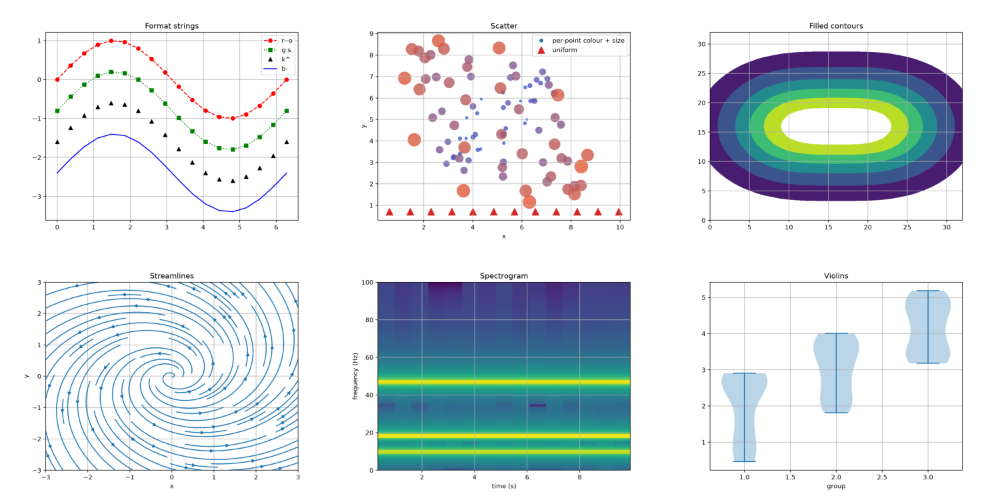
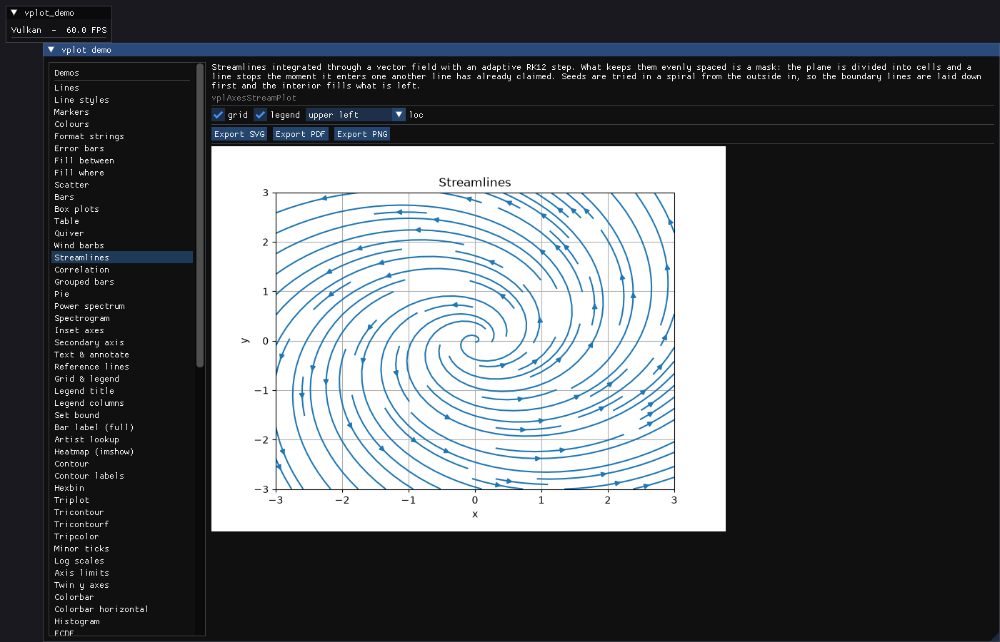

# vplot

[](https://github.com/zzxzzk115/vplot/actions/workflows/ci.yml)
[](LICENSE)

Publication-quality plotting behind a pure C ABI. No Python, no runtime
dependencies, links into anything.

vplot ports matplotlib's rendering stack to C++23 and exposes it through a C
header, so the same figure can be exported as PNG/SVG/PDF for a paper or drawn
live into an ImGui panel inside a renderer.



> **Status: 0.1.1 — early but usable.** Every plotting command in matplotlib's
> headless API surface exists, and about two thirds of them are complete against
> matplotlib's keyword arguments. The rest are usable at their defaults. The API
> is not yet stable. See [`docs/API-COVERAGE.md`](docs/API-COVERAGE.md) for the
> exact per-method status and [`TODO.md`](TODO.md) for the roadmap.

## Features

- **Plotting**: lines with styles and markers, scatter with per-point colour and
  size, bars (stacked and horizontal), histograms, box and violin plots, error
  bars, `fill_between` bands, stem/step/stairs/stackplot, event rugs, spans,
  reference lines, filled polygons, pie charts.
- **2-D fields**: heatmaps (`imshow`, `matshow`, `pcolormesh`), line and filled
  contours, spectrograms, hexbin, triangulated grids; vector fields (`quiver`,
  `barbs`, `streamplot`); the spectral family (`psd`, `csd`, `cohere`,
  `specgram`, and the single spectra).
- **Text and annotation**: labels, titles, legends (including `loc="best"` and
  all positions), text and annotations with leader arrows, multi-line labels.
  Mathtext supports the superscript form a log axis needs
  (`$\mathdefault{10^{2}}$`); fractions, radicals and the full symbol table are
  not yet implemented.
- **Axes**: linear and log scales, minor ticks, custom tick positions and
  labels, per-spine visibility, aspect ratios, inverted axes, twin axes,
  colorbars, subplot grids with `tight_layout`, and figure-level labels.
- **Output**: an RGBA buffer in memory, PNG, SVG and PDF. SVG and PDF embed text
  as glyph outlines, so a figure renders identically on a machine without the
  font installed — the same choice matplotlib makes (`svg.fonttype: path`,
  `pdf.fonttype: 3`).

Colours accept matplotlib's specs (`"C0"`, `"tab:red"`, `"#1f77b4"`, `"0.4"`)
and `plot` accepts format strings like `"r--o"`.

## Example

From C:

```c
VplFigure *fig = NULL;
vplCreateFigure(NULL, &fig);

VplAxes *ax = NULL;
vplFigureAddSubplot(fig, 1, 1, 1, &ax);
vplAxesPlot(ax, xs, ys, count, NULL, NULL);
vplAxesSetTitle(ax, "hello");

vplFigureRenderRGBA(fig, pixels, pixels_size, NULL);  /* RGBA8888, top row first */
vplFigureSaveFig(fig, "figure.pdf", NULL);            /* also .svg and .png */
vplDestroyFigure(fig);
```

Or from C++, through the header-only wrapper in `include/vpl/vpl.hpp`, which
mirrors matplotlib's API closely enough that porting Python is nearly a
transcription:

```cpp
#include "vpl/vpl.hpp"

vplot::Figure fig;               // fig = plt.figure()
auto ax = fig.subplots();        // ax  = fig.subplots()

ax.plot(xs, ys, {.label = "sin"});          // ax.plot(xs, ys, label="sin")
ax.plot(xs, ys2, "r--");                    // ax.plot(xs, ys2, "r--")
ax.set_xlabel("t");                         // ax.set_xlabel("t")
ax.legend();                                // ax.legend()

fig.savefig("figure.pdf");       // also .svg and .png; the figure frees itself
```

The C ABI is the stable binary boundary; the C++ layer is a zero-overhead
convenience that inlines into it. It adds the overloads C cannot have
(`plot(y)`, `plot(x, y)`, `plot(x, y, fmt)`), turns keyword arguments into a
`{.label = ...}` options struct, accepts `std::vector` and `{1, 2, 3}` directly,
and throws `vplot::Error` where a C call would return a code. `.raw()` drops to
the C ABI for anything the wrapper does not cover.

## Design

vplot reuses matplotlib's own C++ rendering core rather than reimplementing it.
matplotlib's Agg driver, path pipeline (clipping, snapping, dashing,
simplification) and image resampler are templated over abstract iterator
concepts rather than Python types; the CPython coupling sits in a single small
adaptor. Replacing that adaptor with one over plain C arrays makes the whole
core usable unchanged.

Because the rasterizer is matplotlib's own, matching matplotlib's output is a
matter of convergence rather than architecture. The core is C++ rather than Rust
for the same reason: a different rasterizer would produce different antialiasing
on every pixel, and matplotlib's baseline images are the acceptance spec.

Embedding follows matplotlib's own backend design: render with Agg, upload the
RGBA buffer as a texture, and draw it — so what appears on screen is the same
raster that goes into the PNG.

## Verification

Correctness is measured, not asserted. `tests/test_baseline.cpp` renders each
figure, compares it against a committed matplotlib reference image using
matplotlib's own RMS metric, and fails on any visible difference. The references
are committed, so the suite runs with no Python present. Over 110 cases cover
the plotting commands, and text drawn at a given origin is bit-for-bit identical
to matplotlib's.

API coverage is generated the same way: `tools/api_coverage.py` introspects the
installed matplotlib and cross-checks every claim against the public headers, so
`docs/API-COVERAGE.md` cannot claim coverage the library does not have.

## Building

```bash
xmake f -y && xmake build
xmake test
```

Browse everything the library can do, ImGui-demo style — pick a feature, tweak
it live, export it:

```bash
xmake run example-demo
```



Or render the whole catalogue to PNG without opening a window:

```bash
xmake run export-demos build/demos
```

Both drive the same builders in `examples/demo/demos.h`, so the exported images
cannot drift from what the browser shows.

## Using it from CMake

xmake is the development build — it drives the examples, the tests and the
differential harness. To consume the library, a hand-written `CMakeLists.txt` at
the root builds and installs a single target:

```cmake
CPMAddPackage("gh:zzxzzk115/vplot@0.1.1")
target_link_libraries(app PRIVATE vplot::vplot)
```

`FetchContent` and a plain `add_subdirectory` work the same way, and an
installed copy is found with `find_package(vplot)`.

vplot needs FreeType and zlib. Any copy you already have is used — vcpkg, Conan,
a system package, or your own `FetchContent`. If you have neither,
`-DVPLOT_FETCH_DEPENDENCIES=ON` downloads them (off by default). See
`examples/cmake_consumer` for a complete C consumer.

## Layout

| Path | Contents |
|---|---|
| `include/vpl/` | public C ABI and the header-only C++ wrapper |
| `source/vplot/` | geometry, ticker, colours, figure/axes, renderer backends |
| `source/vplot/render/mpl/` | rendering core lifted from matplotlib |
| `external/agg24-svn/` | vendored Anti-Grain Geometry 2.4 |
| `tests/` | unit tests and the differential harness against matplotlib |
| `tools/` | reference-image and coverage generators (Python, never shipped) |
| `examples/` | the demo browser and a minimal ImGui embedding example |
| `docs/API-COVERAGE.md` | generated per-method coverage status |

## License

MIT (see [`LICENSE`](LICENSE)). Includes code from matplotlib, Anti-Grain
Geometry and others, all under permissive licenses. See `THIRD-PARTY-NOTICES`
for the attribution each one requires.

## Acknowledgements

Built on [matplotlib](https://matplotlib.org/)'s rendering core and
[Anti-Grain Geometry](https://en.wikipedia.org/wiki/Anti-Grain_Geometry).
